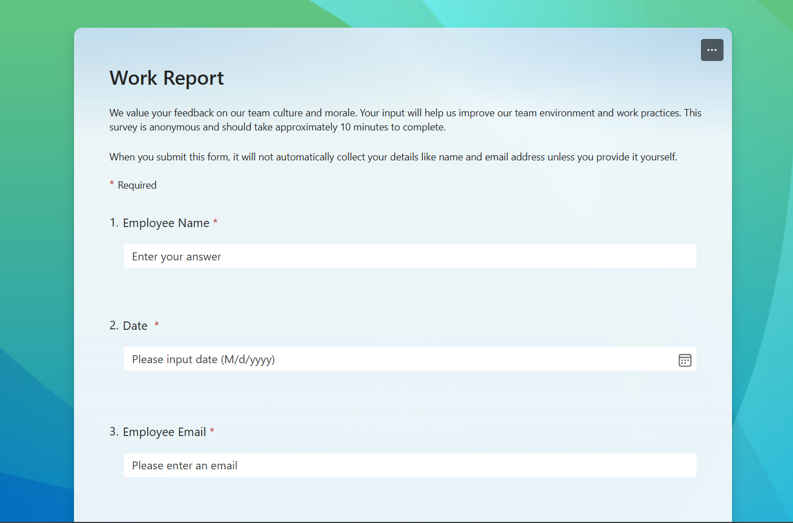
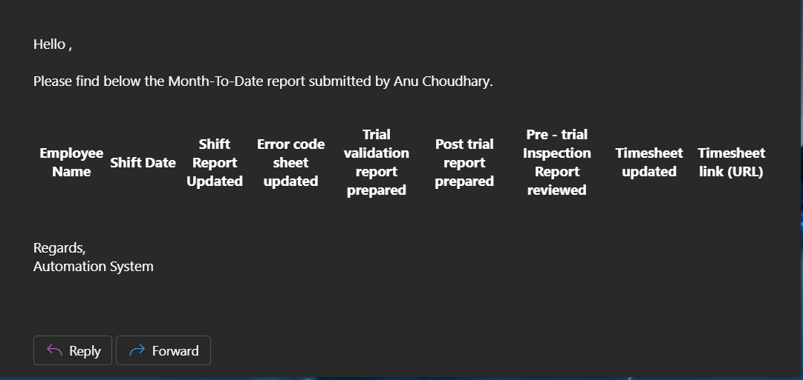
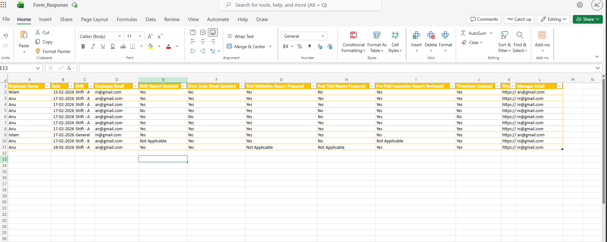
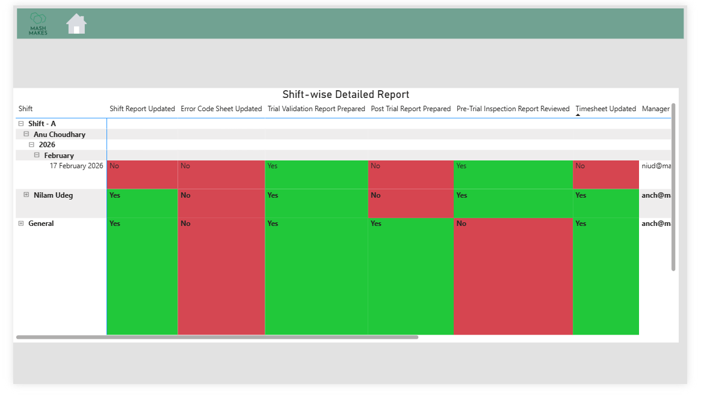

# 🚀 Employee Performance Tracking System (MTD)
### Power Automate + Power BI | End-to-End Workflow Automation

## 📌 Overview
This project automates employee reporting and provides real-time performance insights using Microsoft Forms, Power Automate, and Power BI.

It eliminates manual reporting by creating a seamless flow from data collection to automated email reporting and dashboard visualization.

## 🎯 Objective
- Automate daily employee report submission  
- Generate Month-To-Date (MTD) performance reports  
- Provide interactive dashboards for managers  
- Improve reporting efficiency and accuracy  

## 🔄 Workflow

1. Employees submit daily reports via Microsoft Forms  
2. Power Automate triggers automatically on form submission  
3. Data is processed and filtered using MTD (Month-To-Date) logic  
4. Email report is sent to the respective manager  
5. Data is stored for further analysis  
6. Power BI dashboard is connected for visualization  

## 🛠️ Tools & Technologies

- Microsoft Forms  
- Power Automate  
- Power BI  

## ✨ Key Features

- Automated email notifications to managers  
- Month-To-Date (MTD) performance tracking  
- Real-time dashboard visualization  
- Reduced manual effort and human errors  
- End-to-end automated workflow  

## 📊 Dashboard Insights

The Power BI dashboard includes:

- Employee performance tracking  
- Daily and MTD summaries  
- Trend analysis  
- Manager-level insights  

## 📸 Screenshots

### Microsoft Form  

### Power Automate Flow  

### 📧 Email Notification (Manager Output)  

> ⚠️ Note: Actual email screenshots are not included due to organizational data privacy restrictions.

### 📂 Data Storage (Excel / SharePoint)  

### Power BI Dashboard  

## 🏗️ Architecture

The system follows an end-to-end automated workflow from data collection to visualization:

Microsoft Forms → Power Automate → Data Storage → Power BI

                 
## 📈 Impact

- Automated the complete reporting process  
- Reduced manual work significantly  
- Improved visibility of employee performance  
- Enabled data-driven decision-making  

## 🔮 Future Enhancements

- Integration with SQL/Azure database  
- Role-based access control  
- Real-time alerts  
- Advanced analytics and forecasting  

## 💡 Learnings

- Built an end-to-end automation workflow  
- Applied business logic using Power Automate  
- Integrated Power BI for data visualization  
- Gained experience in real-world reporting systems  

## 👤 Author

**Anu Choudhary**  
B.Tech AI & Data Science  
Aspiring Data Engineer  

## ⚠️ Note
Due to confidentiality, the flow package (.zip) is not included.
