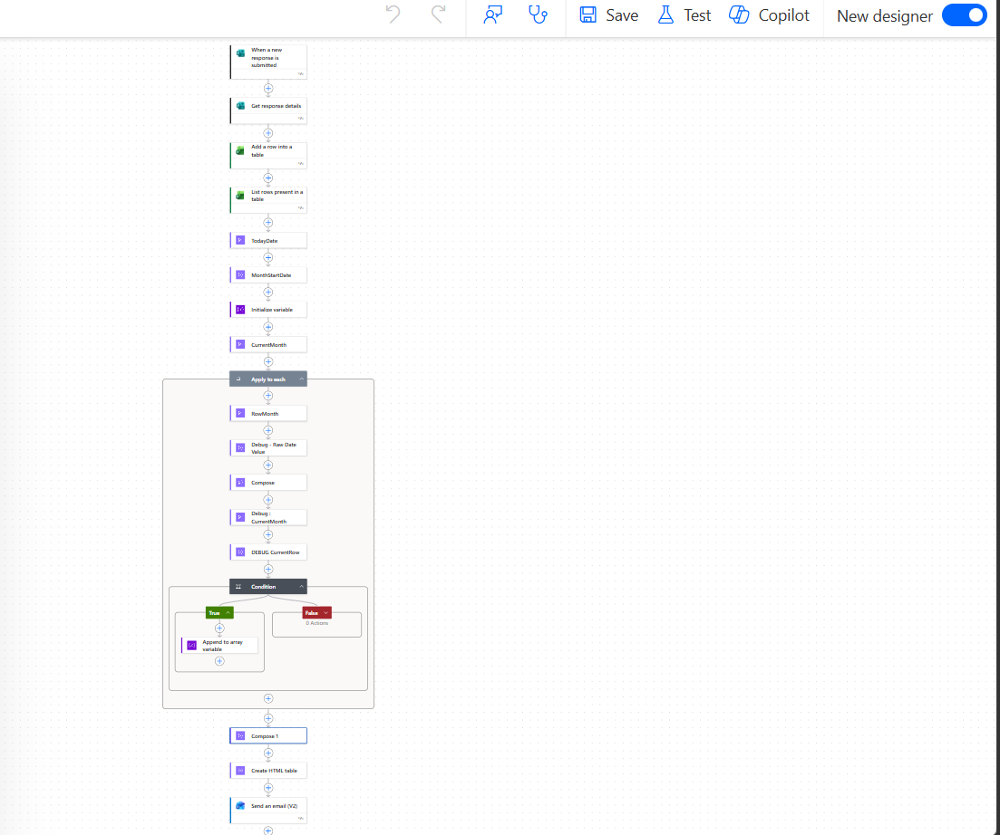

# 🚀 Employee Performance Tracking System (MTD)
### Power Automate + Power BI | End-to-End Workflow Automation

---

## 📌 Overview
This project automates employee reporting and provides real-time performance insights using Microsoft Forms, Power Automate, and Power BI.

It eliminates manual reporting by creating a seamless flow from data collection to automated email reporting and dashboard visualization.

---

## 🎯 Objective
- Automate daily employee report submission  
- Generate Month-To-Date (MTD) performance reports  
- Provide interactive dashboards for managers  
- Improve reporting efficiency and accuracy  

---

## 🔄 Workflow

1. Employees submit daily reports via Microsoft Forms  
2. Power Automate triggers automatically on form submission  
3. Data is processed and filtered using MTD (Month-To-Date) logic  
4. Email report is sent to the respective manager  
5. Data is stored for further analysis  
6. Power BI dashboard is connected for visualization  

---

## 🛠️ Tools & Technologies

- Microsoft Forms  
- Power Automate  
- Power BI  

---

## ✨ Key Features

- Automated email notifications to managers  
- Month-To-Date (MTD) performance tracking  
- Real-time dashboard visualization  
- Reduced manual effort and human errors  
- End-to-end automated workflow  

---

## 📊 Dashboard Insights

The Power BI dashboard includes:

- Employee performance tracking  
- Daily and MTD summaries  
- Trend analysis  
- Manager-level insights  

---

## 📸 Screenshots

> 📁 Create a folder named `images` in your repository and add screenshots

### Microsoft Form  

### Power Automate Flow  

### Power BI Dashboard  

---

## 🏗️ Architecture

🚀 Employee Performance Tracking System (MTD)

Power Automate + Power BI | End-to-End Business Workflow Automation

## 📌 Overview
This project automates employee reporting using Microsoft Forms and Power Automate.

---

## ⚙️ Workflow
1. Employee fills Microsoft Form  
2. Flow triggers on submission  
3. Manager email is captured dynamically  
4. Email is sent to manager  
5. Data tracked in MTD format  

---

## 🛠️ Tools Used
- Microsoft Forms  
- Power Automate  
- Outlook  

---

## 📸 Screenshots

### Flow Overview

### Form Preview

### Email Output

---

## ⚠️ Note
Due to confidentiality, the flow package (.zip) is not included.
